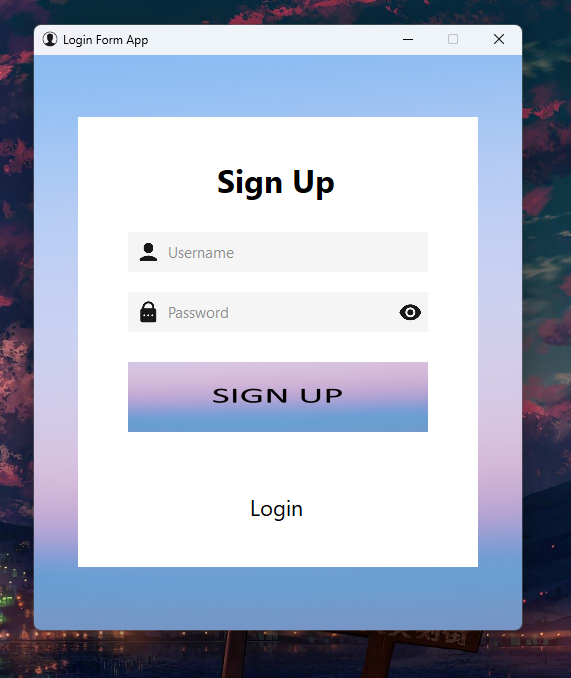
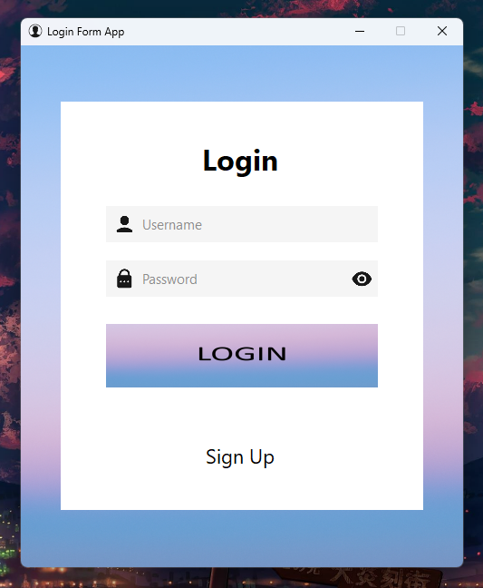
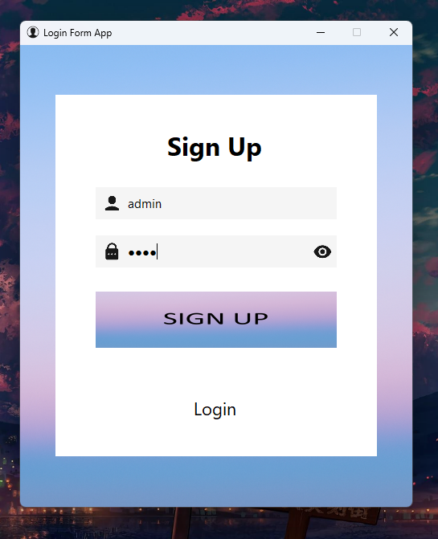

# 🔐 Login Form App

### - Developed by Özgür Kadakal

**⚠️ Önemli:** İndirdiğiniz `.zip` dosyasını ayıklayıp projeyi bu şekilde açınız. Aksi takdirde proje düzgün şekilde çalışmayabilir.

**⚠️ Important:** Please extract the downloaded `.zip` file before opening the project. Otherwise, it may not work properly.

---

## 🖼️ Preview

### 🧾 Register Screen / Kayıt Ekranı  

### 🔐 Login Screen / Giriş Ekranı 

### 🧾 Input Screen / Girdi Ekranı 

---

## 🌍 English

### 🔐 Login Form App  
A basic and functional login/register application developed with C# and Windows Forms by Özgür Kadakal.

### ✨ Features  
- 🖱️ Button and label **hover effects** for improved interactivity  
- 🔐 Password **show/hide toggle**  
- 🗂️ Text file (`users.txt`) used as a simple data storage method  
- ✅ Username duplication check  
- 🎨 Modern and clean UI design  

> 💡 **Note:** Artificial intelligence was used in the file operations section.

> ⚠️ **Important:** Do not manually modify the generated `users.txt` file. Any manual changes such as editing or deleting user data may break the application.

---

## 🇹🇷 Türkçe

### 🔐 Login Form App  
C# ve Windows Forms kullanılarak Özgür Kadakal tarafından geliştirilmiş temel ve işlevsel bir giriş/kayıt uygulamasıdır.

### ✨ Özellikler  
- 🖱️ Buton ve etiketlerde **hover (üzerine gelme) efektleri**  
- 🔐 Şifre **gizleme/gösterme özelliği**  
- 🗂️ `users.txt` dosyası basit bir veri saklama yöntemi olarak kullanılır  
- ✅ Kullanıcı adı tekrar kontrolü  
- 🎨 Modern ve sade arayüz tasarımı  

> 💡 **Not:** Dosya işlemleri kısmında yapay zekadan faydalanılmıştır.  

> ⚠️ **Önemli Uyarı:** Uygulama tarafından oluşturulan `users.txt` dosyasında elle değişiklik yapmayınız. Kullanıcı verilerini silmek veya dosyayı düzenlemek uygulamanın çalışmasını bozabilir.

---

## 📬 Contact | İletişim  
For any feedback, questions, or suggestions, feel free to contact me:  
📧 ozgurkreach@gmail.com

Her türlü geri bildirim, soru veya öneri için:  
📧 ozgurkreach@gmail.com
